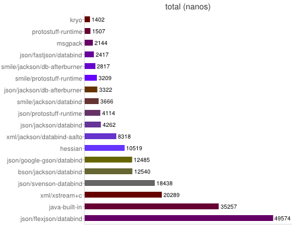
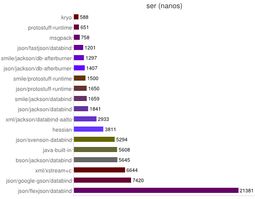
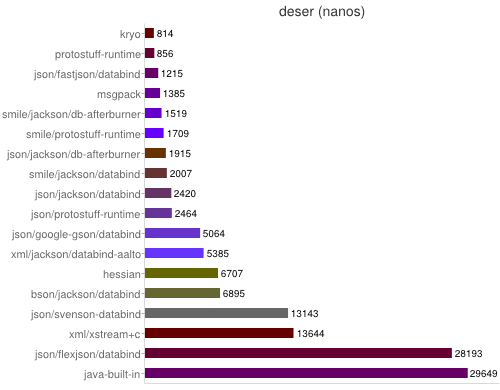
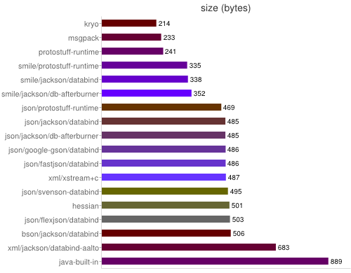
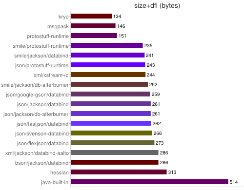
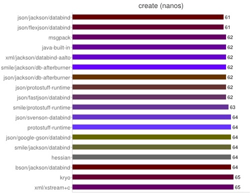

# **kin-serialization**
java 序列化相关工具

## **目前流行的java序列化框架性能对比**

## **实现**
### **java内置+hessian+protobuf**
缓存并复用`ByteArrayOutputStream`, 减少轻微的创建`ByteArrayOutputStream`带来性能消耗. 细节请看`OutputStreams`

### **protobuf+kryo**
底层使用基于`ByteBuffer`, `DirectByteBuffer`和`Unsafe`提升序列化和反序列化性能. 细节请看`Inputs`和`Outputs`

## **注意事项**
* 目前, 除了kinbuffer, protobuf和kryo外, 其余序列化仅支持序列化和反序列一个对象实例, 其原因归咎于, 无法区分每个对象序列化后的边界